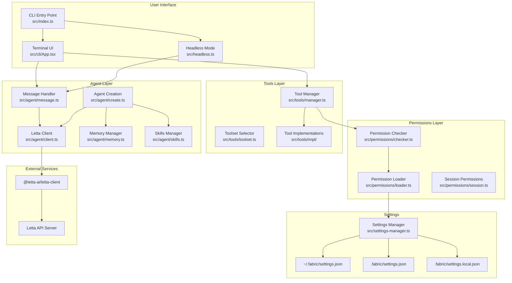
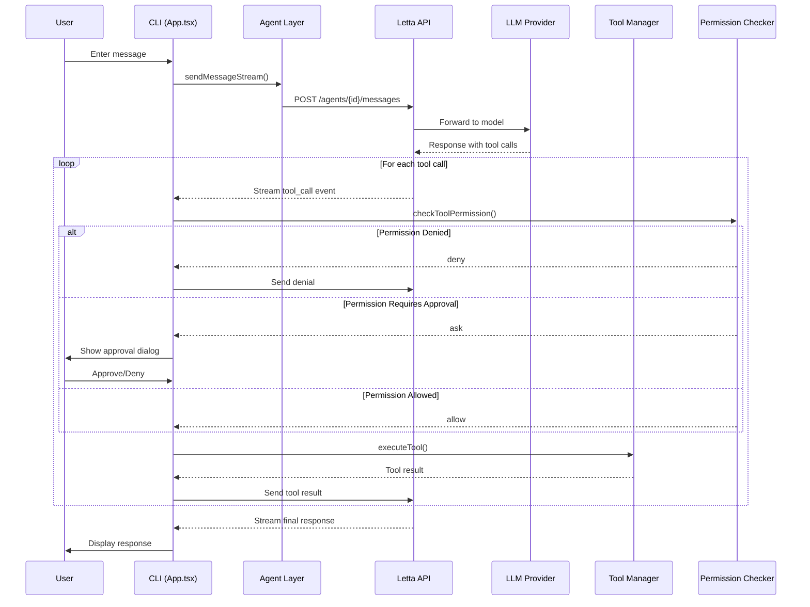
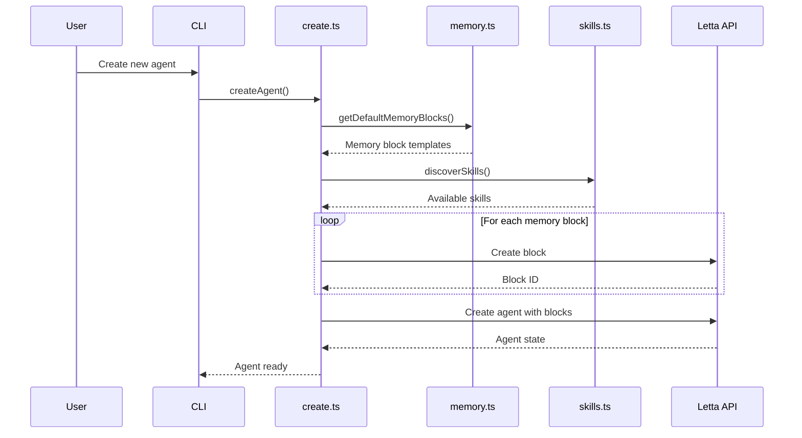
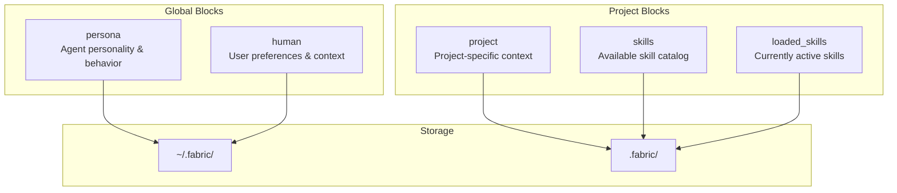
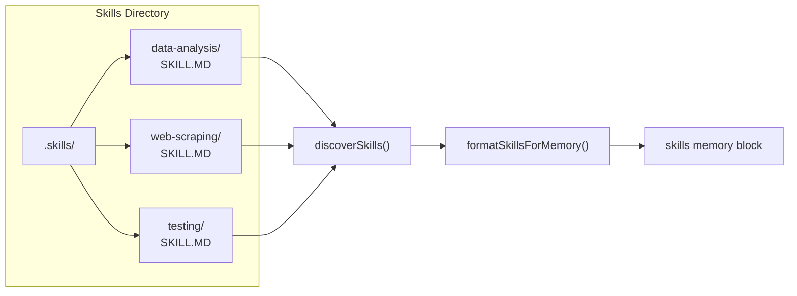
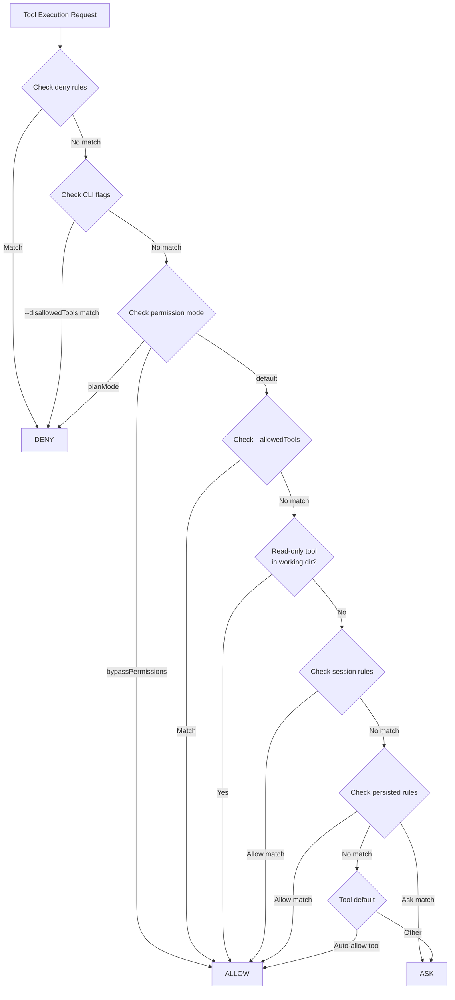
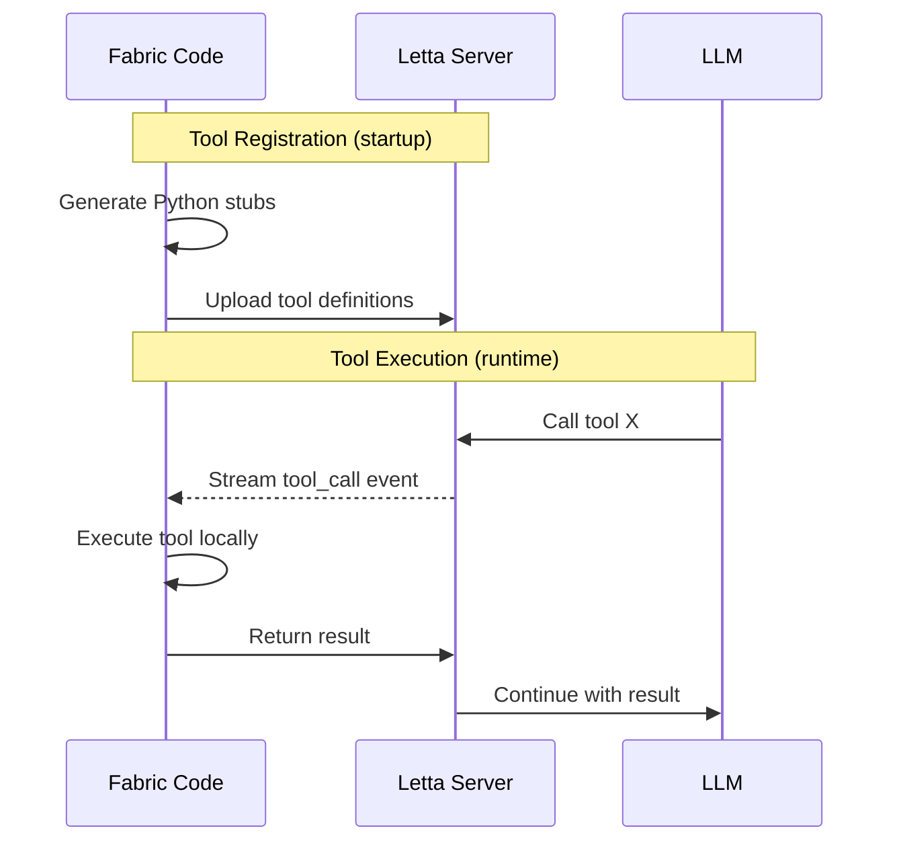

# Fabric Code Architecture

This document provides a comprehensive overview of Fabric Code's internal architecture, including component interactions, data flows, and key design decisions.

## Table of Contents

- [Overview](#overview)
- [High-Level Architecture](#high-level-architecture)
- [Component Breakdown](#component-breakdown)
- [Data Flow](#data-flow)
- [Memory System](#memory-system)
- [Skills System](#skills-system)
- [Permission System](#permission-system)
- [Key Concepts](#key-concepts)

---

## Overview

Fabric Code is a **CLI harness** for interacting with AI agents that use **Letta** as a persistent memory backend. Unlike session-based coding assistants, Fabric Code maintains agent state across sessions, enabling learning and memory persistence.

### Key Distinction

| Component | What It Is | Role |
|-----------|------------|------|
| **Fabric Code** | This repository - a CLI application | User interface, tool execution, permissions |
| **Letta Client SDK** | `@letta-ai/letta-client` npm package | API client for communicating with Letta |
| **Letta API** | Cloud service at `app.letta.com` | Agent state, memory storage, LLM orchestration |

```
┌─────────────────────────────────────────────────────────────────┐
│                        User Terminal                            │
└─────────────────────────────────────────────────────────────────┘
                                │
                                ▼
┌─────────────────────────────────────────────────────────────────┐
│                      Fabric Code CLI                            │
│  ┌──────────┐  ┌──────────┐  ┌──────────┐  ┌──────────────────┐ │
│  │   CLI    │  │  Agent   │  │  Tools   │  │   Permissions    │ │
│  │  Layer   │  │  Layer   │  │  Layer   │  │      Layer       │ │
│  └──────────┘  └──────────┘  └──────────┘  └──────────────────┘ │
└─────────────────────────────────────────────────────────────────┘
                                │
                                ▼ @letta-ai/letta-client
┌─────────────────────────────────────────────────────────────────┐
│                      Letta API Server                           │
│  ┌──────────────┐  ┌──────────────┐  ┌────────────────────────┐ │
│  │ Agent State  │  │ Memory Blocks│  │    LLM Orchestration   │ │
│  └──────────────┘  └──────────────┘  └────────────────────────┘ │
└─────────────────────────────────────────────────────────────────┘
                                │
                                ▼
┌─────────────────────────────────────────────────────────────────┐
│              LLM Providers (Claude, GPT, Gemini, etc.)          │
└─────────────────────────────────────────────────────────────────┘
```

---

## High-Level Architecture



---

## Component Breakdown

### CLI Layer (`src/cli/`)

The CLI layer handles user interaction through a React-based terminal UI (using [Ink](https://github.com/vadimdemedes/ink)).

| File | Purpose |
|------|---------|
| `App.tsx` | Main application component, orchestrates UI state and message flow |
| `components/` | UI components (Input, Messages, Dialogs, Selectors) |
| `commands/` | Slash command handlers (`/profile`, `/clear`, `/remember`, etc.) |
| `helpers/` | Utility functions for message accumulation, formatting |

### Agent Layer (`src/agent/`)

The agent layer manages communication with the Letta backend and agent lifecycle.

| File | Purpose |
|------|---------|
| `client.ts` | Creates authenticated Letta client instance |
| `create.ts` | Creates new agents with memory blocks and tools |
| `message.ts` | Sends messages to agent and handles streaming responses |
| `memory.ts` | Loads and manages memory block templates |
| `skills.ts` | Discovers and formats skills from `.skills/` directory |
| `model.ts` | Model resolution and configuration |
| `promptAssets.ts` | System prompt management |

### Tools Layer (`src/tools/`)

The tools layer defines and executes tools that the agent can invoke.

| File | Purpose |
|------|---------|
| `manager.ts` | Central tool registry, execution, and permission integration |
| `toolset.ts` | Selects appropriate toolset based on model provider |
| `impl/` | Individual tool implementations (Read, Write, Bash, etc.) |
| `definitions/` | Tool schemas and metadata |

### Permissions Layer (`src/permissions/`)

The permissions layer controls which tools can execute and with what arguments.

| File | Purpose |
|------|---------|
| `checker.ts` | Main permission decision logic |
| `loader.ts` | Loads permission rules from settings files |
| `session.ts` | Manages session-only permission grants |
| `matcher.ts` | Pattern matching for file paths and commands |
| `analyzer.ts` | Analyzes tool calls for approval context |
| `types.ts` | TypeScript type definitions |

### Settings Layer (`src/settings-manager.ts`)

Manages configuration at multiple levels:

- **Global**: `~/.fabric/settings.json` - User-wide settings
- **Project**: `.fabric/settings.json` - Shared project settings (committed)
- **Local**: `.fabric/settings.local.json` - Personal project settings (gitignored)

---

## Data Flow

### User Message Flow



### Agent Creation Flow



---

## Memory System

Fabric Code uses Letta's memory block system to maintain persistent agent state.

### Memory Block Types



### Memory Block Details

| Block | Scope | Purpose | Editable by Agent |
|-------|-------|---------|-------------------|
| `persona` | Global | Agent's personality, coding style, behavior guidelines | Yes |
| `human` | Global | User's preferences, communication style, context | Yes |
| `project` | Project | Project-specific information, conventions, architecture | Yes |
| `skills` | Project | Catalog of available skills (read-only) | No |
| `loaded_skills` | Project | Currently loaded skill instructions | No |

### Memory Persistence

Memory blocks are stored on the Letta server and persist across sessions:

1. **On agent creation**: Blocks are initialized from `.mdx` template files
2. **During conversation**: Agent can update blocks via `memory` tool
3. **Across sessions**: Changes persist on Letta server
4. **Cross-project**: Global blocks (`persona`, `human`) are shared

---

## Skills System

Skills are reusable instruction modules that extend agent capabilities.

### Skill Discovery



### Skill File Format

fSkills are defined in `SKILL.MD` files with YAML frontmatter:

```markdown
---
name: Data Analysis
description: Analyze datasets and generate insights
category: analytics
tags: [data, pandas, visualization]
---

## Instructions

When performing data analysis...
```

### Skill Loading

1. **Discovery**: `discoverSkills()` recursively finds `SKILL.MD` files
2. **Parsing**: Extracts frontmatter metadata and content
3. **Catalog**: Formats skills into the `skills` memory block
4. **Loading**: Agent uses `Skill` tool to load specific skills into `loaded_skills`

---

## Permission System

The permission system controls tool execution to ensure safety.

### Permission Decision Flow



### Permission Rule Priority

1. **Deny rules** (highest) - Always checked first
2. **CLI `--disallowedTools`** - Command-line overrides
3. **Permission mode** - `bypassPermissions` or `planMode`
4. **CLI `--allowedTools`** - Command-line allows
5. **Working directory** - Read tools auto-allowed in project
6. **Session rules** - Temporary grants for current session
7. **Persisted rules** - Saved in settings files
8. **Tool defaults** - Built-in tool behavior

### Permission Storage

```
~/.fabric/settings.json          # Global permission rules
.fabric/settings.local.json      # Project-specific rules (gitignored)
```

Example permission configuration:

```json
{
  "permissions": {
    "allow": [
      "Read(**)",
      "Bash(npm test*)",
      "Bash(git status)"
    ],
    "deny": [
      "Bash(rm -rf*)",
      "Write(/etc/*)"
    ],
    "ask": [
      "Write(**)"
    ]
  }
}
```

---

## Key Concepts

### Fabric Code vs Letta

Understanding the separation is crucial:

| Aspect | Fabric Code | Letta |
|--------|-------------|-------|
| **Type** | CLI application | Cloud service |
| **Runs** | Locally on your machine | Remote servers |
| **Handles** | UI, tool execution, permissions | Agent state, memory, LLM calls |
| **Storage** | Settings, local config | Agent data, memory blocks |
| **Auth** | `LETTA_API_KEY` env var | API key validation |

### Agent State Persistence

Unlike stateless coding assistants:

1. **Memory persists** - Agent remembers across sessions
2. **Learning accumulates** - Preferences and context build up
3. **Project context** - Each project can have its own agent
4. **Global knowledge** - User preferences shared across projects

### Tool Registration

Tools are registered with Letta as Python stubs:

1. **Definition**: Tools defined in TypeScript (`src/tools/impl/`)
2. **Stub generation**: Python stubs created for Letta registration
3. **Server registration**: Stubs uploaded to Letta via `upsertToolsToServer()`
4. **Execution**: When agent calls tool, Fabric Code executes locally



### Toolset Selection

Different LLM providers have different tool naming conventions:

| Provider | Toolset | Example Tool Names |
|----------|---------|-------------------|
| Anthropic | `anthropic` | `Read`, `Write`, `Bash` |
| OpenAI | `codex` | `read_file`, `write_file`, `shell` |
| Google | `gemini` | `ReadFile`, `WriteFile`, `Shell` |

The tool manager maps between internal names and provider-specific names.

---

## Related Documentation

- [Development Guide](./development.md) - Building, testing, and contributing
- [README](../README.md) - Getting started and usage

